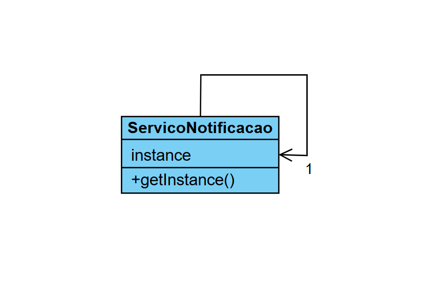

# padraoSingleton# Padrão Singleton

O padrão Singleton garante que uma classe tenha apenas uma instância e fornece um ponto de acesso global a essa instância.

## Contexto Aplicado

O projeto demonstra o Singleton através de um Serviço de Notificaçao. A ideia é ter um único objeto responsável por gerenciar configurações (como chaves de API, servidor de e-mail) e centralizar o envio de notificações, evitando o consumo desnecessário de recursos e garantindo um estado consistente.

## Estrutura
- Construtor privado para impedir a instanciação direta.

- Um atributo estático privado para armazenar a única instância.

- Um método estático público ```getInstance()``` que retorna a instância única.

## Diagrama de Classes


